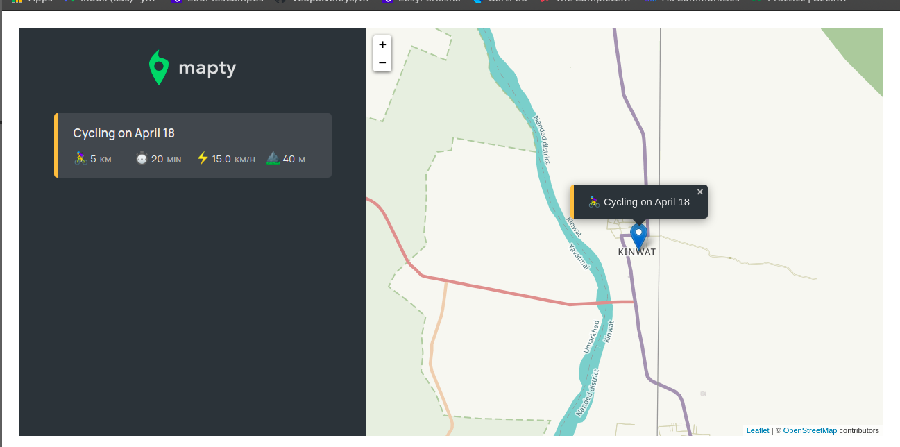

# Mapty-
<h2><b>Mapty App</b>: It stores the location of workouts with maps </h2>  
 
<h3> In this project I used OOP concepts, Geolocation api and java-script</h3>
<h3> The flow of project</h3>

<h3> The Architecture of project </h3>

  
<h3> Here is a glimpse of project </h3>

  
<h3> I made this project while learning javascript from course on udemy </h3>

